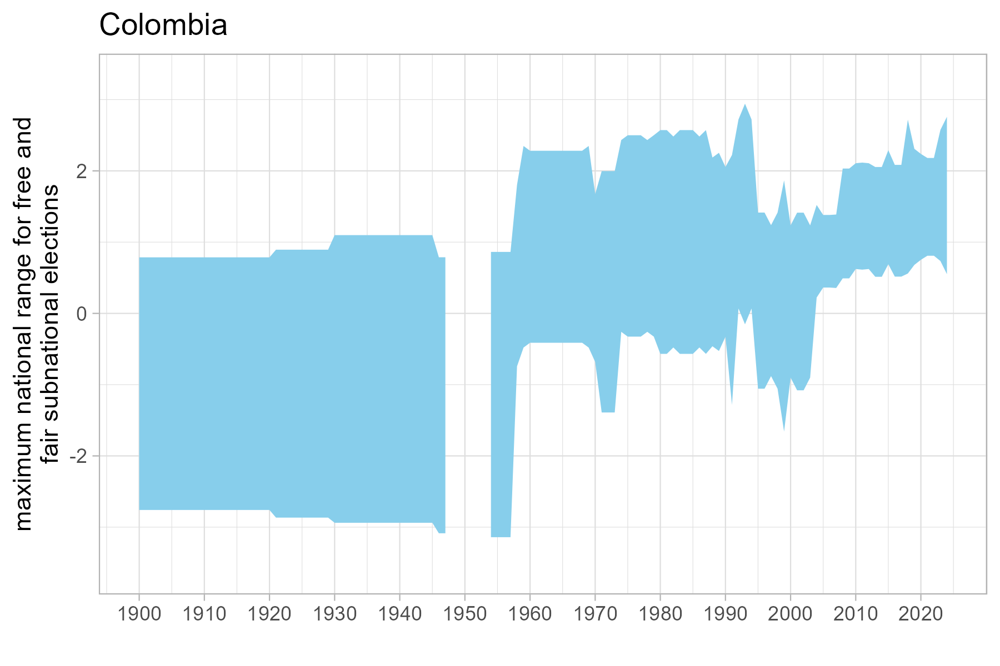
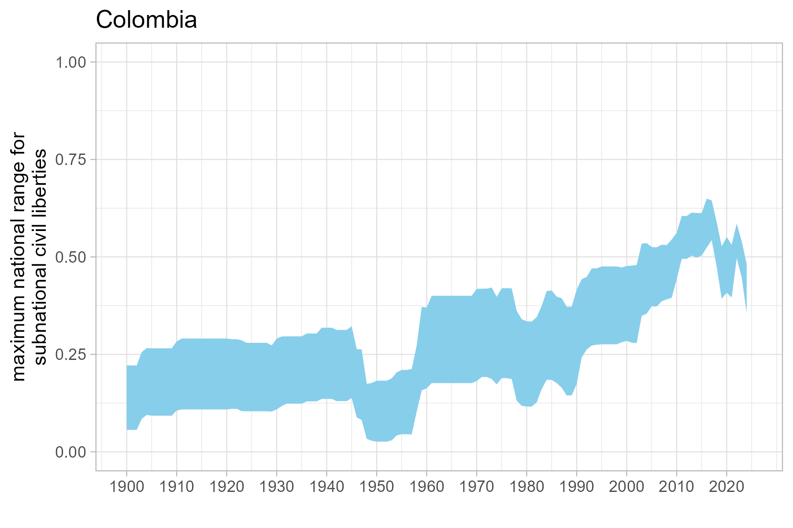

---
output:
  pdf_document: default
  html_document: default
header-includes:
  - \usepackage{float}
  - \floatplacement{figure}{H}
  - \usepackage{fvextra}
  - \DefineVerbatimEnvironment{Highlighting}{Verbatim}{breaklines,commandchars=\\\{\}}
  - \DefineVerbatimEnvironment{verbatim}{Verbatim}{breaklines}
---
# Benchmarking Memo 2: The Benchmarking Process and How It Compares to the Pre-Benchmarked Data

**Date:** July 6, 2026
**Prepared by:** PM, with assistance from Claude Code Sonnet 5
**For:** The SNVDEM-COL team

---

## Recap

1. **Memo 1** (`benchmarking_memo.pdf`, June 26) laid out the scale-mismatch problem between `EL_col_mt` and `CL_col_mt`.
2. **MC's email reply** (July 2) resolved that benchmarked scores are the intended final measure, combined via `qnorm()` on the civil-liberties side.
3. **This memo** reports on implementing that resolution, focused on the benchmarking step itself:
- **Section 1**, brief context on where benchmarking sits in the pipeline.
- **Section 2**, the inputs the benchmarking step depends on (the V-Dem-derived range and the weighted geopredictors).
- **Section 3**, the benchmarking process itself.
- **Section 4**, how the resulting benchmarked measure compares to the pre-benchmarked (unbenchmarked) data reported in our latest draft.
- **Section 5**, what each measure is for.
- **Section 6**, open questions.

---

## 1. Where benchmarking fits

The pipeline builds the democracy index in two stages: earlier steps clean and weight municipal-level geopredictors into an **unbenchmarked** index (`snvdem_col_weighted` -- the version reported in our latest draft); a later step then **benchmarks** that index against V-Dem's national estimates to produce `snvdem_col_benchmarked`. Sections 2-3 below cover what feeds into that benchmarking step and how it works; Section 4 compares its output to the pre-benchmarked data.


---

## 2. Inputs to benchmarking

### 2.1 The HPD range (`04_vdem_data/02_vdem_weighting/02_vdem_weighting.R`)

For both elections and civil liberties, the pipeline needs a single per-country-year number representing how far a municipality's score could plausibly sit above or below the *national* score. The benchmarking step spreads a national V-Dem estimate out across municipalities instead of assigning every municipality the same value.

The range is built from V-Dem's own Bayesian uncertainty interval (`HPD`, the highest-posterior-density width already reported by V-Dem's measurement model, `codehigh - codelow`), scaled down according to whether coders actually reported subnational variation existing at all:

```r
# Elections (v2elsnlsff: 0 = "significant variation", 1 = "somewhat", 2 = "none")
weighted_range = (snlsff_1 * HPD + snlsff_0 * 2 * HPD) / (snlsff_0 + snlsff_1 + snlsff_2)

# Civil liberties (v2clrgunev, same response scale)
wtdCL_range = (clrgunev_1 * CLHPD + clrgunev_0 * 2 * CLHPD) / (clrgunev_0 + clrgunev_1 + clrgunev_2)
```

**Bug found and fixed 2026-07-03:** this formula had the category weights inverted (weighting the "no variation" responses by 2 and dropping "significant variation" from the numerator entirely), which systematically *understated* Colombia's range in most years -- the code above is the corrected version.





### 2.2 Civil liberties needs a proxy center, elections doesn't

Elections has a ready-made subnational summary variable (`v2elffelr`) to center the range on. Civil liberties doesn't -- V-Dem provides no direct equivalent, so the pipeline builds one:

```r
CLSNmean = v2x_civlib * (100 - v2clsnlpct) / 100
```

(`v2clsnlpct` = V-Dem's own estimate of the percent of the population living under weaker-than-national civil liberties.) This is the same construction Section 3 below relies on for the benchmarked measure's civil-liberties anchor.

### 2.3 Criterion relevance weights (`ELCLweights_wide.dta`)

Separately from the HPD range, V-Dem coders who named one area of a country MORE or LESS free-and-fair (or, for CL, STRONGER or WEAKER) were also asked "why" -- these are the 22 yes/no characteristics (Rural, Urban, Indigenous, Inside_capital, ... None_of_the_above). For each criterion, per country-year, this pipeline computes:

```
pr_i = (coders citing criterion i) / (coders citing it + coders not citing it + coders reporting no subnational variation at all)
relevance_weight_i = |pr_i(more/stronger side) - pr_i(less/weaker side)|
```

A criterion cited equally often on both sides isn't actually distinguishing anything and gets a low weight; one cited lopsidedly gets a high weight. This produces `ELCLweights_wide.dta` (44 columns: 22 criteria x elections/CL), which is used to decide how much each geographic predictor should count toward the unbenchmarked index.

**Two bugs found and fixed 2026-07-02, confirmed 2026-07-06 with a direct before/after comparison:**
1. Three criteria (Less_development, More_development, Inside_capital) divided by the wrong zero-count.
2. Two criteria (Outside_capital, North) were swapped due to out-of-order computation.

Comparing the current output against the preserved pre-fix file confirms the fix changed *only* the 5 affected criteria (in both the elections and CL weight sets) -- all other 17 criteria per family are bit-for-bit identical (correlation = 1.000) to the original. For Colombia, the swap bug alone had flipped North/Outside_capital in every single country-year (mean $|\Delta| \approx$ 0.5).

### 2.4 Combining geopredictors and weights into the pre-benchmarked index

```r
snelect  = sum(geopredictor_k * weight_k, available k) / sum(weight_k, available k)   # renormalized
sncivlib = sum(geopredictor_k * weight_k, available k) / sum(weight_k, available k)
sndem    = 0.5 * (snelect + sncivlib)
```

Missing geopredictors (682 of ~26,928 municipality-years) are handled by dropping the (geopredictor, weight) pair together and renormalizing over what's left -- but only when at least half the original weight mass survives; below that, the row is left `NA` rather than resting on a handful of criteria. Re-running the current pipeline, `snelect` and `sncivlib` both show **0 remaining `NA`s**.

This -- `sndem`, `snelect`, `sncivlib` -- is the pre-benchmarked data reported in our latest draft. Section 3 below is what turns it into the benchmarked measure.

---

## 3. The benchmarking process (`snvdem_col_benchmarked`)

Each municipality's pre-benchmarked (unbenchmarked) score is re-expressed as a deviation from the actual V-Dem national estimate, scaled by the Section 2.1 range:

```r
# 06_benchmark/01_benchmark/01_benchmark.R
EL_col_mt = v2elffelr + (snelect  - snelectyrmean) * weighted_range / ELrange_975_025
CL_col_mt = CLSNmean  + (sncivlib - CLSNyrmean)   * wtdCL_range   / CLrange_975_025
```

| Dimension | Municipal anchor | Built from |
|---|---|---|
| Elections | `v2elffelr` | V-Dem's "Subnational elections free and fair" -- latent scale, ~[-3.5, 3.5] |
| Civil liberties | `CLSNmean` (Section 2.2) | `v2x_civlib` ([0,1]) discounted by `v2clsnlpct` |

**Why the two anchors are on different native scales.** `v2elffelr` is a V-Dem "component" (C) variable straight from the coder-level IRT model, on its raw unbounded latent scale. Civil liberties has no equivalent; `v2x_civlib` is a Bayesian-factor-analysis composite, which V-Dem's methodology converts to [0,1] via the normal CDF. `qnorm(CLSNmean)` below is the correct inverse of that same link function.

**Combining on a common, globally comparable scale.** `CL_col_mt` is converted to a Z-score with `qnorm()`; both dimensions are then standardized against fixed constants computed once from the full V-Dem country-year panel (all countries, 2000-2023), not from Colombia's data alone:

```r
CL_col_z    <- qnorm(CL_col_mt)
EL_col_gz   <- (EL_col_mt - EL_global_mean) / EL_global_sd
CL_col_gz   <- (CL_col_z  - CL_global_mean) / CL_global_sd
sndem_final <- 0.5 * (EL_col_gz + CL_col_gz)
```

The global CL reference must be built from the same discounted `CLSNmean` construction as the municipal anchor, not raw `v2x_civlib`.

**What it represents:** each municipality's position relative to the entire V-Dem world, not just the rest of Colombia -- anchored to Colombia's real national trajectory and standardized against fixed global constants so it supports cross-country comparison once the pipeline is extended.

---

## 4. Comparing the benchmarked measure to the pre-benchmarked data

Global reference constants (full V-Dem panel, 2000-2023, all countries): `v2elffelr` mean = 0.789, sd = 1.593; `qnorm(CLSNmean)`-style mean = -0.172, sd = 0.729. `CL_col_mt` stays inside **[0.292, 0.581]** for Colombia throughout, clear of the (0,1) boundary `qnorm()` needs to stay finite.

Colombia's national trajectory (`EL_col_gz`/`CL_col_gz`/`snvdem_col_benchmarked`, global-standardized -- 0 = full V-Dem 2000-2023 average) by year:

| Year | EL | CL | snvdem_col_benchmarked |
|---|---|---|---|
| 2000 | -0.390 | -0.192 | -0.291 |
| 2004 | 0.052 | -0.081 | -0.014 |
| 2008 | 0.297 | -0.045 | 0.126 |
| 2012 | 0.362 | 0.235 | 0.299 |
| 2016 | 0.321 | 0.355 | 0.338 |
| 2020 | 0.443 | 0.042 | 0.243 |
| 2023 | 0.544 | 0.153 | 0.348 |

Colombia moves from modestly below the global average in 2000-2003, through roughly average 2004-2009, to consistently above average from 2010 on -- elections leads civil liberties for most of the series (peaking 0.534-0.544 in 2018/2023 vs. CL's peak of 0.414 in 2017), with both dimensions dipping together in 2019-2021 before partial recovery.

Four checks confirm the benchmarked measure relates to the pre-benchmarked data the way it's supposed to:

- **Tracks Colombia's real national trajectory** -- `EL_col_gz` tracks the globally-standardized raw V-Dem elections anchor *exactly*, by construction: `snelectyrmean` is the true cross-municipality mean of `snelect`, so `(snelect - snelectyrmean)` averages to zero and the municipal mean of `EL_col_mt` collapses to `v2elffelr` every year (checked: max discrepancy = 0, to floating-point precision). `CL_col_gz` only tracks its anchor approximately, and the dominant reason turns out not to be `qnorm()` -- see Section 6.2, a new open question raised by digging into this gap.

  

- **Spatial and temporal variation** -- a fixed-color-scale map across all 24 years (color scale fixed to the full panel's own range, **[-0.758, 0.671]**) shows municipalities visibly differing from one another within every year, not just over time.

  

- **Elections vs. civil liberties, compared directly and in context.**

  

  

- **No spatial rank inversion**: `weighted_range`/`wtdCL_range` are non-negative in all 24 years, and the within-year correlation between each municipality's pre-benchmarked and benchmarked score is **r = 1.000 in every year, both dimensions** -- benchmarking preserves each municipality's relative standing rather than distorting it. Top vs. bottom pre-benchmarked decile: mean `EL_col_mt` of 1.982 vs. 1.153, monotonically increasing across all ten deciles.

As a secondary check, `snvdem_col_benchmarked` (global standardization, current) correlates at **0.9948** with a Colombia-only `scale()` alternative -- confirming both are linear rescales of the same underlying shape, and that global standardization was the right generalizable choice without changing the substantive trend.

---

## 5. What each measure is for / suggested presentation

**Pre-benchmarked / unbenchmarked (`sndem`, `snelect`, `sncivlib` -- the data in our latest draft):** within-Colombia analysis -- relative democratic quality across municipalities, isolating spatial variation from national-level shifts.

**Benchmarked (`sndem_final`, `EL_col_mt`, `CL_col_mt`, `EL_col_gz`/`CL_col_gz`):** whenever the question involves an absolute or externally anchored reference point -- Colombia's own historical trend, or comparison with other countries once the pipeline is extended.

Suggested paper structure: lead with the unbenchmarked maps for the paper's core within-Colombia contribution; use the benchmarked measure to situate Colombia against the global V-Dem scale; include a short methods note distinguishing the two for readers.

---

## 6. Open questions to resolve

### 6.1 Possible double-inversion in the criterion relevance weights (high priority)

**The issue:** the weight matrices that turn Section 2.3's criterion relevance weights into geopredictor weights (`el_wt_mat`/`cl_wt_mat`, [01_weighting_geopredictors.R:207-215](../../05_weighting/01_weighting_geopredictors/01_weighting_geopredictors.R#L207-L215)) apply `1 - weight` instead of the raw relevance weight for 5 of 16 geopredictor-weight pairings: Indigenous, Ruling_party_strong, Ruling_party_weak, Inside_capital, Outside_capital. This is inherited verbatim from MC's original script ([wts_predictors_v2.R:16](../../05_weighting/01_weighting_geopredictors/MC/wts_predictors_v2.R#L16)), whose own lead-in comment ("Which paired variables have high values that disfavor democracy?") suggests it was deliberate, not accidental.

Separately, an earlier step already flips the *geopredictor's* direction for 6 groups ([01_clean_geocode.R:79-92](../../03_geocoded_panel/01_clean_geocoded/01_clean_geocode.R#L79-L92)), including 3 of those same 5: Indigenous (line 91), Ruling_party/`Compete` (both directions, line 92), and Inside/Outside_capital via `BogProx` (line 84). The other 3 flipped groups -- Urban/Rural (line 81), Violence (line 87), Remote/`MerProx` (line 89) -- do **not** get a weight flip, and North/South/West/East -- which that same script explicitly declines to flip, deferring to "the V-Dem coder weights in 05_weighting" (lines 85-86) -- do not actually get any flip either.

**Why this matters:** a geopredictor-direction flip and a relevance-weight flip are mathematically different operations -- flipping a non-negative relevance weight doesn't reverse a geopredictor's contribution sign. But it does invert which criteria get emphasized: a criterion coders rarely cite as distinguishing freer from less-free areas (low relevance weight) becomes one of the *most* heavily weighted after `1 - weight`, which runs counter to what a relevance weight is supposed to do. Neither the code nor the operational strategy doc explains why these specific 3-5 criteria need this treatment and the others don't.

**Downstream effect:** this flows directly into `snelect`/`sncivlib` and therefore into `sndem`, `sndem_final`, `EL_col_mt`, and `CL_col_mt` -- i.e. every figure in Sections 3-5 of this memo. Resolving it may change the relative contribution of these 5 criteria (and the Urban/Rural/Violence/Remote criteria that plausibly should be treated the same way but aren't) to both the pre-benchmarked and benchmarked measures.

**Recommended next step:** confirm with MC whether this was an intentional correction (and if so, what its rule was meant to be) before treating either version as settled.

### 6.2 `CLSNyrmean` doesn't isolate civil liberties the way `snelectyrmean` does (high priority)

**The issue:** in [01_benchmark.R:58-67](../../06_benchmark/01_benchmark/01_benchmark.R#L58-L67), `snelectyrmean` is defined as `mean(snelect, na.rm = TRUE)` -- the actual cross-municipality average of the pre-benchmarked elections predictor, so `(snelect - snelectyrmean)` in the `EL_col_mt` formula (Section 3) is a  "deviation from Colombia's own average" term. The civil-liberties equivalent, `CLSNyrmean`, is instead defined as `mean(CLSNmean, na.rm = TRUE)` -- but `CLSNmean` is already a national-level constant (identical across every municipality within a year), so this line just computes the mean of a constant, which trivially re-equals `CLSNmean` itself. `CLSNyrmean` isn't the CL-equivalent of `snelectyrmean` at all: `(sncivlib - CLSNyrmean)` ends up subtracting the *national anchor* from the *municipal predictor*, rather than subtracting the *municipal predictor's own cross-sectional mean* from itself.

**Confirmed empirically:** swapping in `mean(sncivlib, na.rm = TRUE)` for `CLSNyrmean` makes the municipal mean of `CL_col_mt` match `CLSNmean` exactly, every year (current max gap: 0.052 in raw `CL_col_mt` units; corrected: 0) -- exactly mirroring how elections already behaves. This is the dominant cause of the residual gap visible in the civil-liberties panel of the first figure in Section 4, not the `qnorm()` nonlinearity previously assumed to be the explanation. (`qnorm()` does contribute a smaller, genuinely-expected residual on top -- averaging `qnorm(CL_col_mt)` municipality-by-municipality isn't the same as `qnorm()` of the municipality average, roughly -0.005 to -0.13 in z-score units -- but that effect is secondary to this one.)

**Inherited from MC's original script** ([COL_benchmarked.R:33-34](../../06_benchmark/01_benchmark/MC/COL_benchmarked.R#L33-L34), unchanged) -- structurally the same situation as 6.1 and 6.3 in that respect, and not something this revision introduced. Neither version comments on why elections and civil liberties would be centered differently, which makes an unintentional asymmetry the more likely reading, but it's a design decision only MC can confirm before it's changed.

**Downstream effect:** affects `CL_col_mt`, `CL_col_z`, `CL_col_gz`, and `sndem_final` in every year -- the civil-liberties trajectory in Section 4 and the combined trend it feeds into throughout Sections 4-5.

**Recommended next step:** confirm with MC whether `CLSNyrmean` was deliberately built differently from `snelectyrmean`, or should be redefined as `mean(sncivlib, na.rm = TRUE)` to match. If it's an oversight, it's a one-line fix ([01_benchmark.R:62](../../06_benchmark/01_benchmark/01_benchmark.R#L62)) with no other structural changes needed -- but the same standard applied throughout this memo holds here too: diff the old and new output and trace a few concrete municipality-years before treating a corrected version as final, not just a formula-level argument.

### 6.3 `snlsff_2` reused as the "not asked" denominator for civil-liberties criteria

The criterion-weight calculation (Section 2.3, [02_vdem_weighting.R:275-312](../../04_vdem_data/02_vdem_weighting/02_vdem_weighting.R#L275-L312)) uses `snlsff_2` (elections' own "no subnational variation" coder count) as an extra denominator term for **all 4** variable families, including the two civil-liberties ones (`v2clrgstch`/`v2clrgwkch`), rather than CL's own `clrgunev_2` ("Subnational civil liberties unevenness"). Confirmed inherited unchanged from MC's original script.

**Checked the actual divergence** (Colombia, 2000-2024, from `snlsffHPD.dta`/`SNHPD.dta`): `snlsff_2` averages **4.88** coders (range 0-8) while `clrgunev_2` averages only **0.48** (range 0-2) -- about 10x smaller -- and the two are essentially uncorrelated (r = -0.05). They differ in 21 of 25 years, by 4.4 coders on average. In plain terms: V-Dem coders are far more likely to say Colombia's *elections* show no subnational variation than to say the same about *civil liberties*, and the two judgments don't move together year to year. So using `snlsff_2` in the civil-liberties formula adds several "phantom" no-variation coders (4-8 extra, most years) to the denominator of every CL criterion's proportion, which systematically shrinks the CL relevance weights relative to what `clrgunev_2` would produce.

**Why flagged as "not wrong" rather than "a bug":** unlike 6.1 and the two bugs fixed in Sections 2.1/2.3, this substitution is inherited unchanged from MC's original script rather than something introduced or altered in this revision -- so it may be an intentional simplification (e.g., treating "no subnational variation" as one country-level judgment regardless of which dimension a coder was actually asked about, rather than as two independently measured facts), not an oversight. Worth confirming deliberately rather than assuming the original choice was incidental.

---

## Files

- `04_vdem_data/02_vdem_weighting/02_vdem_weighting.R` -- HPD range + criterion relevance weights (Section 2.1-2.3); writes `04_vdem_data/03_outputs/{ELCLweights_wide,snlsffHPD,SNHPD}.dta`
- `05_weighting/01_weighting_geopredictors/01_weighting_geopredictors.R` -- pre-benchmarked index (`sndem`) (Section 2.4); writes `05_weighting/03_output/snvdem_col_weighted.rds`
- `06_benchmark/01_benchmark/01_benchmark.R` -- benchmarked index (`sndem_final`) (Section 3); writes `06_benchmark/03_output/snvdem_col_benchmarked.rds`
- `06_benchmark/02_diagnostics/01_scripts/01_validate_map.R`, `02_trend_diagnostics.R`, `03_spatial_rank_check.R` -- maps/validation in Section 4; outputs in `02_diagnostics/02_outputs/`
- `07_snvdem-col_diagnostics/` -- comparison workspace for the pre-benchmarked vs. benchmarked datasets (see the two output paths listed above)
